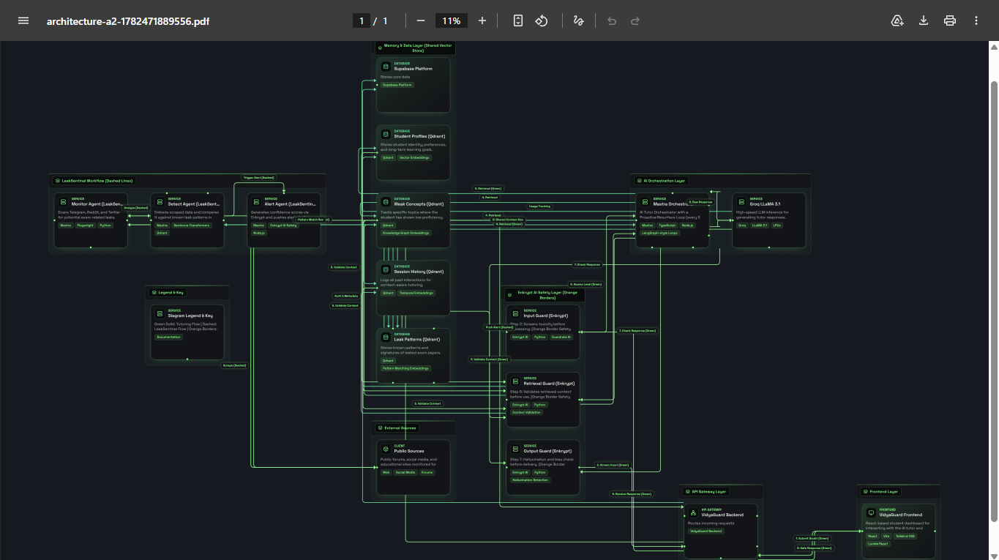

<div align="center">

# VidyaGuard AI 🛡️

### Student Doubt-Solving & Learning Agent

*Personalized AI tutoring with memory, safety, and academic integrity — built for the HiDevs × Mastra Hackathon 2026*


</div>

---

## The Problem

99% of Indian competitive exam students study in isolation. They:
- Have doubts at 11pm with no one to ask
- Don't know which concepts are genuinely weak vs temporarily forgotten
- Have no way to detect if exam content is circulating online before their exam
- Lose months of prep because they keep revisiting strong areas while ignoring real gaps

A static chatbot solves none of this. A tutor that **remembers you across sessions**, **proactively resurfaces your weak concepts**, and **monitors the internet for leaks in real time** — that's VidyaGuard AI.

---

## What VidyaGuard AI Does

VidyaGuard AI is a **production-grade AI agent** — not a chatbot wrapper — built on Mastra, Qdrant, and Enkrypt AI. It has two core systems running simultaneously:

### 1. Personalized AI Tutor
- Understands your knowledge level on first interaction via 5–10 diagnostic questions
- Adapts every explanation to your level: concept → example → common mistake → practice question
- Tracks weak concepts across every session using Qdrant vector memory
- Automatically resurfaces your weakest topics every 5 sessions without you asking
- Every response passes through 3 Enkrypt AI safety checkpoints before reaching you

### 2. LeakSentinel — Exam Integrity Monitor
- Runs as a **parallel Mastra workflow** scanning Telegram groups, Reddit, and X/Twitter continuously
- Detects potential exam paper leaks by comparing scraped content against a `leak_patterns` Qdrant collection
- Assigns confidence scores via Enkrypt AI before sending any alert
- Surfaces alerts inline in the tutor — "Focus on alternate clusters for tomorrow's paper"
- The same Qdrant instance powers both the tutor memory AND leak detection — unified intelligence

---

## System Architecture



> Full architecture generated via HiDevs Architecture Copilot. [Download PDF](./architecture.pdf)


### Architecture Highlights

| Layer | Technology | Role |
|---|---|---|
| Orchestration | Mastra | Manages all agent workflows, tool calls, branching logic, proactive resurface loop |
| Vector Memory | Qdrant | 4 collections — student_profiles, weak_concepts, session_history, leak_patterns |
| Safety | Enkrypt AI | 3-stage pipeline — Input Guard, Retrieval Guard, Output Guard |
| LLM Inference | Groq LLaMA 3.1 | Fast educational explanation generation |
| Frontend | React + Vite | Student dashboard, doubt input, weak area heatmap |
| Backend | Node.js + Express | API gateway, session manager, webhook handler |
| Auth & Metadata | Supabase | User authentication, structured student data |

---

## The 8-Step Request Pipeline

```
Student submits doubt
        │
        ▼
[1] Input Guard (Enkrypt AI)
    Screens for toxicity and inappropriate content
        │
        ▼
[2] Mastra Orchestration begins
    5-10 branching diagnostic questions to assess level
        │
        ▼
[3] Qdrant Retrieval
    Fetches student_profile + weak_concepts + session_history + leak_patterns
        │
        ▼
[4] Retrieval Guard (Enkrypt AI)
    Validates retrieved context for accuracy and relevance
        │
        ▼
[5] Groq LLaMA 3.1 generates explanation
    concept → example → common mistake → practice question
        │
        ▼
[6] Output Guard (Enkrypt AI)
    Hallucination check · bias check · factual accuracy · safety
        │
        ▼
[7] Student receives safe, personalized, memory-aware response
        │
        ▼
[8] Qdrant write-back
    Updates session outcome, weak concept scores, timestamps
```

---

## Qdrant Collections

```
qdrant/
├── student_profiles        # Knowledge level, learning style, exam goal, pace
├── weak_concepts           # Topic, struggle count, last reviewed timestamp
├── session_history         # Past doubt Q&A pairs, embeddings for contextual recall
└── leak_patterns           # Known question/paper fingerprints (shared with LeakSentinel)
```

The `leak_patterns` collection is the **shared intelligence bridge** — it is written to by LeakSentinel's Detect Agent and read by the main tutor's Retrieval step. This means:
- If a student asks a question matching a known leak pattern, the Retrieval Guard flags it immediately
- The tutor can proactively redirect the student to safer topic clusters
- No duplicate infrastructure needed — one Qdrant instance, two workflows, unified memory

---

## Enkrypt AI — 3-Stage Safety Pipeline

VidyaGuard AI is the only student tutor with safety at every step, not just the output:

```
Stage 1 — Input Guard
  Position: Between student input and Mastra
  Screens: Toxicity, inappropriate content, prompt injection attempts

Stage 2 — Retrieval Guard  
  Position: Between Qdrant and Mastra
  Screens: Context accuracy, relevance validation, stale memory detection

Stage 3 — Output Guard
  Position: Between Mastra and student response
  Screens: Hallucinations, factual accuracy, bias, educational safety
```

Three Enkrypt checkpoints across one request — not a single end-of-pipeline filter.

---

## Mastra — Orchestration Depth

Mastra is not used as a simple LLM wrapper. It runs:

- **Diagnostic workflow** — branching question flow to assess student level on first interaction
- **Retrieval routing** — decides which Qdrant collections to query based on doubt topic
- **Proactive resurface loop** — a scheduled trigger that fires every 5 sessions, pulls top weak concepts from Qdrant, and initiates a review session automatically
- **LeakSentinel workflow** — a parallel agent chain (Monitor → Detect → Alert) running independently of the tutoring flow but sharing the same Qdrant and Enkrypt layers
- **Human-in-the-loop** — flags low-confidence leak alerts for manual review before sending

---

## LeakSentinel — Parallel Mastra Workflow

```
Public Sources (Telegram, Reddit, X/Twitter)
        │
        ▼
Monitor Agent (Mastra + Playwright + Python)
  Scheduled scans of public exam-related groups and threads
        │
        ▼
Detect Agent (Mastra + Qdrant + Sentence-Transformers)
  Embeds scraped content → semantic search against leak_patterns collection
        │
        ▼
Alert Agent (Mastra + Enkrypt AI + Node.js)
  Generates confidence score → Enkrypt validates → alert sent to student dashboard
```

---

## Tech Stack

```
Frontend      React 18 + Vite + Tailwind CSS + Lucide React
Backend       Node.js + Express + WebSocket (real-time alerts)
AI Agent      Mastra (TypeScript) + LangGraph-style loops
LLM           Groq LLaMA 3.1 (70B) via Groq API
Vector DB     Qdrant Cloud (4 collections)
Safety        Enkrypt AI (3-stage evaluation pipeline)
Auth          Supabase (PostgreSQL + Auth)
Scraping      Playwright + Python (LeakSentinel Monitor Agent)
Embeddings    Sentence-Transformers (leak_patterns matching)
Deployment    Vercel (frontend) + Render (backend)
```

---

## Project Structure

```
vidyaguard-ai/
├── frontend/               # React + Vite student dashboard
│   ├── src/
│   │   ├── pages/          # Dashboard, Doubt, LeakSentinel, History
│   │   ├── components/     # WeakConceptHeatmap, SessionCard, AlertBanner
│   │   └── hooks/          # useStudentMemory, useLeakAlerts
├── backend/                # Node.js + Express API
│   ├── routes/             # /doubt, /session, /leaksentinel, /resurface
│   ├── agents/             # Mastra agent definitions
│   │   ├── tutorAgent.ts   # Main tutoring workflow
│   │   └── leakSentinel.ts # Parallel leak detection workflow
│   ├── memory/             # Qdrant collection managers
│   └── safety/             # Enkrypt AI integration (3 stages)
├── scraper/                # Python + Playwright (LeakSentinel Monitor)
├── architecture.png        # System architecture diagram
├── architecture-a2.pdf     # Full architecture PDF
└── README.md
```

---

## Judging Criteria Alignment

| Criteria | Weight | How VidyaGuard AI addresses it |
|---|---|---|
| Mastra integration depth | 25% | Orchestrates tutoring workflow + LeakSentinel as separate parallel workflow + proactive resurface loop + human-in-the-loop |
| Qdrant integration quality | 20% | 4 specialized collections with distinct embedding strategies + dual-purpose `leak_patterns` shared between tutor and LeakSentinel |
| Enkrypt AI coverage | 20% | 3-stage pipeline (Input, Retrieval, Output) — not a single filter |
| Agent output quality | 20% | Structured explanations (concept → example → mistake → practice) + confidence-scored leak alerts |
| Problem impact & novelty | 15% | Unified tutor + academic integrity monitor — no existing solution combines these |

---

## Why This Is Not a Chatbot

| Chatbot | VidyaGuard AI |
|---|---|
| Forgets you after the session | Remembers your weak concepts across all sessions |
| Same response for everyone | Adapts to your exact knowledge level |
| You have to ask for review | Proactively resurfaces weak areas every 5 sessions |
| No safety guarantees | 3 Enkrypt AI checkpoints on every request |
| Single purpose | Tutoring + academic integrity monitoring simultaneously |
| No memory architecture | 4 specialized Qdrant collections with semantic retrieval |

---

## Team

**Team Falcon** — HiDevs × Mastra Hackathon 2026

Built with Mastra · Qdrant · Enkrypt AI · Groq · React · Node.js · Supabase

---

<div align="center">

*VidyaGuard AI — because every student deserves a tutor that remembers them.*

</div>
